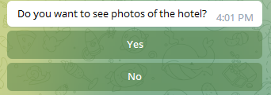

# **Search for hotels in Telegram**
___
This bot allows you to quickly select hotels directly in the Telegram messenger according to various search criteria. 
Try using a bot: https://t.me/PonomarevaDiplomBot

Features
___
This bot allows you to:

* select hotels at the lowest or highest price;
* select hotels according to the best price/distance ratio from the city center;
* set the number of displayed hotels;
* set the price range and distance from the city center;
* set check-in and check-out dates;
* view photos of hotels;
* the bot does not use or request any personal data.
* Bilingual support, dependent on language_code from Telegram Bot API.  It is also possible to force
language changes regardless of language_code

Requirements
___
* Python 3.7+
* pyTelegramBotAPI – Python Telegram Bot API
* requests - requests library
* pee wee - storage of search parameters and query history of each user

You can install all dependencies by running the following command: pip install -r requirements.txt

## Logging
The script of this bot uses the loguru module for logging. You can configure logging parameters
by editing logger_config:
```python
from loguru import logger
logger_config = {
    "handlers": [
        {
            "sink": "logs/bot.log", 
            "format": "{time} | {level} | {message}", 
            "encoding": "utf-8", 
            "level": "DEBUG",
            "rotation": "1 MB", 
            "compression": "zip"
        },
    ],
}
logger.configure(**logger_config)
```
## Bot commands
___
* /start - the bot is started automatically when connected to the bot.
* /help - list of commands and their description
* /low price - top cheap hotels
* /high price - top expensive hotels
* /best deal - best deals
* /history - information about the user's last three search queries
* /settings - menu with settings

  ## How to work with the PonomarevaDiplomBot bot
The list of all commands supported by the bot can be viewed by the command /help 

The /settings command shows the settings menu,


where you can select the search language (by default corresponds to the language_code value from the Telegram Bot API),


or choose your preferred currency from ("RUB", "USD", "EUR") (by default determined by the language_code value: 'ru': 'RUB', 'en': 'USD')


To select the dates of check-in and check-out from the hotel, a calendar is used, implemented in the form of inline buttons.

The /history command displays information about the last three user requests.

Example of a request from history: 

The following is an instruction for working with the bot. In case of an erroneous input, the bot will display the corresponding message and
ask you to enter the value again.

### Top Cheap hotels
1. Enter the /lowprice command. The bot will request the city in which you want to search for hotels.
2. Enter the name of the locality. The bot will make a request to the hotels api and display a list of locations whose names are similar to the entered city. If the bot does not find any location, then you need to enter the name of the city again, perhaps you made a mistake when writing.

Response to the query "New York": 

3. Choose one of the suggested options that best suits your request.
4. The bot will request the number of hotels that you want to display as a result. Enter the number of hotels.
5. The bot will request a check-in date. By clicking on the inline buttons, select the year, month and date.


6. The bot will request the departure date. By clicking on the inline buttons, select the year, month and date.
7. The bot will ask if you want to see a photo of the hotel. Click Yes or No.



8. If you selected "Yes" in the previous paragraph, the bot will request the number of photos for each hotel. Enter a number no more than 6.
9. The bot will execute the following request to the hotels api and display a list of hotels with photos (if they were requested),
indicating the name, class, price, address and distance from the center.

Example of the result: 

### Top expensive hotels
1. To get a list of the most expensive hotels, enter the command /highprice and follow steps 2-5 from the instructions above
for the top cheap hotels.

### Best deals
1. Enter the /bestdeal command. The bot will request the city in which you want to search for hotels.
2. Enter the name of the locality. The bot will make a request to the hotels api and display a list of locations whose names are similar to the entered city. If the bot does not find any location, then you need to enter the name of the city again, perhaps you made a mistake when writing.
3. Choose one of the suggested options that best suits your request.
4. The bot will request a range of prices for hotels. Enter two numbers separated by a space, where the first number is the minimum cost of the hotel, and the second is the maximum.
5. The bot will request the maximum distance from the city center to the hotel. Enter a number.
6. The bot will request the number of hotels that you want to display as a result. Enter the number of hotels.
7. The bot will request a check-in date. By clicking on the inline buttons, select the year, month and date.
8. The bot will request the departure date. By clicking on the inline buttons, select the year, month and date.
9. The bot will ask if you want to see a photo of the hotel. Click Yes or No.
10. If you selected "Yes" in the previous paragraph, the bot will request the number of photos for each hotel. Enter a number no more than 6.
11. The bot will execute the following request to the hotels api and display a list of hotels with photos (if they were requested),
indicating the name, class, price, address and distance from the center.

## Recommendations
The name of the city should consist only of letters of the Russian or English alphabet and the hyphen symbol. 

The price range is two positive integers separated by a space, written in one line. 

The maximum distance from the city center should be written as a positive integer or a real
number. 

The number of hotels displayed is a positive integer. The maximum possible number is 20,
if you enter a number greater than 20, you need to enter it again. 

The maximum number of photos for each hotel is 6.


# **Поиск отелей в Telegram**
___
Этот бот позволяет быстро подбирать отели прямо в мессенджере Telegram по различным критериям поиска. 
Попробуйте использовать бот: https://t.me/PonomarevaDiplomBot

Особенности
___
Данный бот позволяет:

* подбирать отели по самой низкой или высокой цене;
* подбирать отели по лучшему соотношению цена/расстояние от центра города;
* задавать количество выводимых отелей;
* задавать диапазон цен и расстояние от центра города;
* задавать даты заезда и выезда из отеля;
* просматривать фото отелей;
* бот не использует и не запрашивает никакие персональные данные.
* двуязычная поддержка, зависимая от language_code от Telegram Bot API. Так же есть возможность принудительного 
изменения языка в независимости от language_code
Requirements
___
* Python 3.7+
* pyTelegramBotAPI – Python Telegram Bot API
* requests - библиотека requests
* peewee - хранилище поисковых параметров и истории запросов каждого пользователя

Вы можете установить все зависимости, выполнив следующую команду: pip install -r requirements.txt

## Логирование
____
В скрипте этого бота используется модуль loguru для логирования. Вы можете настроить параметры логирования 
отредактировав logger_config:

```python
from loguru import logger
logger_config = {
    "handlers": [
        {
            "sink": "logs/bot.log", 
            "format": "{time} | {level} | {message}", 
            "encoding": "utf-8", 
            "level": "DEBUG",
            "rotation": "1 MB", 
            "compression": "zip"
        },
    ],
}
logger.configure(**logger_config)
```
## Команды бота
___
* /start - запуск бота, выполняется автоматически при подключении к боту.
* /help - список команд и их описание
* /lowprice - топ дешевых отелей
* /highprice - топ дорогих отелей
* /bestdeal - лучшие предложения
* /history - информация о последних трех поисковых запросах пользователя
* /settings - меню с настройками
  
## Как работать с ботом PonomarevaDiplomBot
Список всех команд, поддерживаемых ботом, можно посмотреть по команде /help 

Команда /settings показывает меню настроек,


где вы можете выбрать язык поиска (по умолчанию соответствует значению language_code от Telegram Bot API),


или выбрать предпочтительную валюту из ("RUB", "USD", "EUR") (по умолчанию определяется значением language_code: 'ru': 'RUB', 'en': 'USD')


Для выбора дат заселения и выселения из отеля используется календарь, реализованный в виде инлайн - кнопок.

Команда /history выводит информацию о трех последних запросах пользователя.

Пример запроса из истории: 

Далее приведена инструкция по работе с ботом. При ошибочном вводе бот выведет соответствующее сообщение и 
попросит ввести значение повторно.

### Топ дешевых отелей
1. Введите команду /lowprice. Бот запросит город, в котором вы хотите искать отели.
2. Введите название населенного пункта. Бот выполнит запрос к hotels api и выведет список локаций, названия которых похожи на введенный город. Если бот не найдет ни одну локацию, то необходимо ввести название города еще раз, возможно вы допустили ошибку при написании.

Ответ на запрос "New York": 

3. Выберите один из предложенных вариантов, наиболее подходящих вашему запросу.
4. Бот запросит количество отелей, которые вы хотите вывести в качестве результата. Введите количество отелей.
5. Бот запросит дату заезда. Нажимая на инлайн-кнопки, выберите год, месяц и число.


6. Бот запросит дату отъзда. Нажимая на инлайн-кнопки, выберите год, месяц и число.
7. Бот спросит, хотите ли вы увидеть фото отеля. Нажмите Да или Нет.


8. Если в предыдущем пункте Вы выбрали "Да", бот запросит количество фото для каждого отеля. Введите число не более 6.
9. Бот выполнит следующий запрос к hotels api и выведет список отелей с фото(если они были запрошены), 
указанием названия, класса, цены, адреса и расстояния от центра.

Пример результата: 

### Топ дорогих отелей
1. Для получения списка самых дорогих отелей введите команду /highprice и выполните пункты 2 - 5 из инструкции выше 
для топа дешевых отелей.

### Лучшие предложения
1. Введите команду /bestdeal. Бот запросит город, в котором вы хотите искать отели.
2. Введите название населенного пункта. Бот выполнит запрос к hotels api и выведет список локаций, названия которых похожи на введенный город. Если бот не найдет ни одну локацию, то необходимо ввести название города еще раз, возможно вы допустили ошибку при написании.
3. Выберите один из предложенных вариантов, наиболее подходящих вашему запросу.
4. Бот запросит диапазон цен на отели. Введите два числа через пробел, где первое число это минимальная стоимость отеля, а второе — максимальная.
5. Бот запросит максимальное расстояние от центра города до отеля. Введите число.
6. Бот запросит количество отелей, которые вы хотите вывести в качестве результата. Введите количество отелей.
7. Бот запросит дату заезда. Нажимая на инлайн-кнопки, выберите год, месяц и число.
8. Бот запросит дату отъзда. Нажимая на инлайн-кнопки, выберите год, месяц и число.
9. Бот спросит, хотите ли вы увидеть фото отеля. Нажмите Да или Нет.
10. Если в предыдущем пункте Вы выбрали "Да", бот запросит количество фото для каждого отеля. Введите число не более 6.
11. Бот выполнит следующий запрос к hotels api и выведет список отелей с фото(если они были запрошены), 
указанием названия, класса, цены, адреса и расстояния от центра.

## Рекомендации
Название города должно состоять только из букв русского или английского алфавита и символа дефис. 

Диапазон цен представляет собой два целых положительных числа, разделенных пробелом, написанных в одну строку. 

Максимальное расстояние от центра города должно быть написано в виде положительного целого или вещественного 
числа. 

Количество выводимых отелей — целое положительное число. Максимальное возможное количество - 20, 
при вводе числа больше 20, нужно ввести заново. 

Максимальное количество фото для каждого отеля - 6.
